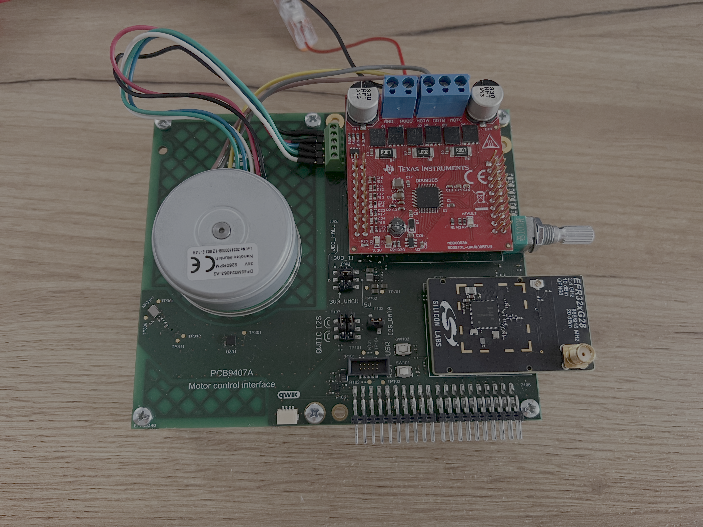

# Motor Control Framework Extension

A **Simplicity Studio 6** SDK extension that brings the [SimpleFOC](https://www.simplefoc.com/) motor control library to the **Simplicity SDK** (SiSDK). It provides a reusable framework component, board-specific configuration overlays, and ready-to-run examples for BLDC motor control on EFR32 radio boards.

Projects are created and configured in Simplicity Studio 6. Build and flash the generated project output with the toolchain and tools you select during project creation (for example GNU Make or CMake, and Simplicity Commander).

## What is included

- **Motor Control Framework component** — Arduino compatibility layer, EFR32 driver/current-sense code, and vendored SimpleFOC library
- **Four example applications** — open loop, Hall sensor, sensorless, and current control
- **Board overlays** — pre-filled pin maps for supported radio boards (see [`overlays/README.md`](motor_control_framework_extension/motor_control_framework/overlays/README.md))

## Requirements

### Software

- [Simplicity Studio 6](https://www.silabs.com/developers/simplicity-studio)
- Simplicity SDK **2025.12.0** installed in Studio (must match the extension version)
- ARM GCC toolchain (installed with the SDK)
- GNU Make or CMake + Ninja, depending on the target IDE chosen at project creation (included in Simplicity Studio 6)
- [Simplicity Commander](https://docs.silabs.com/simplicity-commander/latest/) (for flashing)
- Git (for cloning and submodules)

### Hardware

| Item | Notes |
|------|-------|
| Radio board | [BRD4186C](https://www.silabs.com/development-tools/wireless/xg24-rb4186c-efr32xg24-wireless-gecko-radio-board) (EFR32xG24) or [BRD4401C](https://www.silabs.com/development-tools/wireless/xg28-rb4401c-efr32xg28-2-4-ghz-ble-and-20-dbm-radio-board) (EFR32xG28) |
| Motor driver | [TI BOOSTXL-DRV8305](https://www.ti.com/tool/BOOSTXL-DRV8305EVM) BoosterPack |
| Motor | 3-phase BLDC — reference motor: [Nanotec DF45M024053-A2](https://www.nanotec.com/eu/en/products/1789-df45m024053-a2) |
| Power | 24 V supply for the motor stage |
| Debug | WSTK / debug adapter for programming; J-Link RTT Viewer for serial commands |

A dedicated Motor Control Interface Board can also be used. Wiring details are in the [User Guide](documentation/user_guide.md).



## Getting started

### 1. Clone the repository

```shell
git clone --recurse-submodules <repository-url>
cd devs-simplefoc-port
```

If you already cloned without submodules:

```shell
git submodule update --init --recursive
```

The SimpleFOC library is vendored as a submodule under `motor_control_framework_extension/motor_control_framework/external/simplefoc/`.

### 2. Install the extension in Simplicity Studio 6

Install the parent Simplicity SDK first, then attach this extension to it. See the [SSv6 SDK Extensions guide](https://docs.silabs.com/ssv6ug/latest/ssv6-install-sdk-extensions/).

1. Open **Settings** from the left navigation bar.
2. Go to the **SDKs** section.
3. Select your installed **Simplicity SDK 2025.12.0** entry and click **Add Extension**.
4. Browse to this folder in your clone:

   ```
   motor_control_framework_extension/
   ```

   Studio detects the extension from `motor_control_framework.slce` and the companion template metadata.

5. Check the extension in the list and click **Finish**.
6. When prompted, click **Trust** if you trust this source.

The examples and **Motor Control Framework** component appear after installation. You may need to click **Refresh** on the SDK entry before they show up in the example browser.

### 3. Create an example project

1. From **HOME**, start a new project (all projects & demos), or open **Devices** in the left navigation and select your kit or part.
2. Open the **Example Projects & Demos** tab.
3. Search or filter for **Motor Control Framework** and pick one of:
   - Open Loop Example
   - Hall Sensor Example
   - Sensorless Example
   - Current Control Example
4. Click **CREATE** on the example tile.
5. In **Target Device**, select your radio board (**BRD4186C** or **BRD4401C**) or a compatible part. Use the **Board** filter if needed.
6. In **Project Configuration**, set the project name, location, and **Target IDE** (**Makefile**, **VS Code**, or **CMake**), then click **Finish**.

Studio generates the project and opens the **Project Configurator** (`.slcp`). When a supported board is selected, the pin map in `config/motor_control_framework_config.h` is filled automatically from the board overlay.

### 4. Build, flash, and run

Simplicity Studio 6 does not build or flash firmware. It configures the project and generates source and build files for your chosen target IDE. After any change in the Project Configurator, regenerate the project before building again.

1. **Build** using the generated output for your target IDE:
   - **Makefile:** from the project directory, run `make -f <project_name>.Makefile`
   - **CMake:** configure and build with the generated `CMakeLists.txt`
   - **VS Code:** open the project folder in VS Code and use the generated build tasks
2. **Flash** the `.s37` artifact with Simplicity Commander.
3. Open J-Link RTT Viewer to interact with the SimpleFOC `Commander` interface.
4. After *Motor ready!* (or the sensorless startup sequence completes), send velocity targets with the `M` prefix, e.g. `M30` for 30 rad/s.

Each example has its own readme with control-mode details and tuning notes:

| Example | Readme |
|---------|--------|
| Open Loop | [`mc_open_loop_example/readme.md`](motor_control_framework_extension/examples/mc_open_loop_example/readme.md) |
| Hall Sensor | [`mc_hall_sensor_example/readme.md`](motor_control_framework_extension/examples/mc_hall_sensor_example/readme.md) |
| Sensorless | [`mc_sensorless_example/readme.md`](motor_control_framework_extension/examples/mc_sensorless_example/readme.md) |
| Current Control | [`mc_current_control_example/readme.md`](motor_control_framework_extension/examples/mc_current_control_example/readme.md) |

## Repository layout

```
motor_control_framework_extension/
├── motor_control_framework.slce          # Extension descriptor
├── motor_control_framework.slsdk         # Studio metadata
├── motor_control_framework_extension_templates.xml
├── components/
│   └── motor_control_framework.slcc      # Framework component definition
├── examples/
│   ├── mc_open_loop_example/
│   ├── mc_hall_sensor_example/
│   ├── mc_sensorless_example/
│   └── mc_current_control_example/
└── motor_control_framework/
    ├── config/                           # Generic config template
    ├── overlays/                         # Board-specific config overrides
    ├── common/                           # Arduino layer, drivers, observer
    └── external/simplefoc/               # SimpleFOC submodule
```

## Documentation

- [Simplicity Studio 6 User Guide](https://docs.silabs.com/ssv6ug/latest/) — project creation and Project Configurator
- [Install SDK Extensions (SSv6)](https://docs.silabs.com/ssv6ug/latest/ssv6-install-sdk-extensions/)
- [User Guide](documentation/user_guide.md) — hardware assembly, wiring, RTT and BLE setup
- [Board overlays](motor_control_framework_extension/motor_control_framework/overlays/README.md) — how board-specific config overrides work
- [Simplicity Commander reference](https://www.silabs.com/documents/public/user-guides/ug162-simplicity-commander-reference-guide.pdf)

## Contributing

Please follow the [contributing guidelines](.github/CONTRIBUTING.md).

## License

See [LICENSE.md](LICENSE.md).


## Disclaimer ##

The Motor Control Framework Extension supports development with Silicon Labs IoT SoC and module devices. Unless otherwise specified in the specific directory, all examples are considered to be EXPERIMENTAL QUALITY which implies that the code provided in the repos has not been formally tested and is provided as-is.  It is not suitable for production environments.  In addition, this code will not be maintained and there may be no bug maintenance planned for these resources. Silicon Labs may update projects from time to time.
