# Motor Control User Guide

**Date:** 2026-04-23

---

## Table of contents

1. [Requirements](#requirements)
2. [Hardware setup](#hardware-setup)
   - [Reference setup](#reference-setup)
   - [Assembly](#assembly)
   - [PCB wiring details](#pcb-wiring-details)
   - [Reset button](#reset-button)
   - [WSTK switch](#wstk-switch)
3. [Software setup](#software-setup)
4. [Demo setup](#demo-setup)
   - [System configuration](#system-configuration)
   - [J-Link RTT Viewer configuration](#j-link-rtt-viewer-configuration)
   - [BLE Connection Setup](#ble-connection-setup)

---

## Requirements

- 1x Motor Control Interface Board (PCB9407A)
- 1x [EFR32xG24B (BRD4186C)](https://www.silabs.com/development-tools/wireless/xg24-rb4186c-efr32xg24-wireless-gecko-radio-board?tab=overview) or [EFR32xG28 (BRD4401C)](https://www.silabs.com/development-tools/wireless/xg28-rb4401c-efr32xg28-2-4-ghz-ble-and-20-dbm-radio-board?tab=overview)
- 1x [DRV8305 BoosterPack (BOOSTXL-DRV8305EVM)](https://www.ti.com/tool/BOOSTXL-DRV8305EVM)
- 1x [BLDC Motor: DF45M024053 – A2](https://www.nanotec.com/eu/en/products/1789-df45m024053-a2)
- 1x PSU (24V, min. 1.4A)
- 1x Wireless Starter Kit (WSTK)
- 1x STK/WSTK Debug Adapter (BRD8010A)
- 1x phone with the [Si Connect](https://www.silabs.com/software-and-tools/simplicity-connect-mobile-app?tab=overview) application installed
- 1x 10-pin ribbon cable
- [SEGGER J-Link RTT Viewer](https://www.segger.com/products/debug-probes/j-link/tools/rtt-viewer)
- [Simplicity Commander](https://www.silabs.com/developer-tools/simplicity-studio/simplicity-commander)
- Built firmware binary (.s37 file)

---

## Hardware setup

### Reference setup:
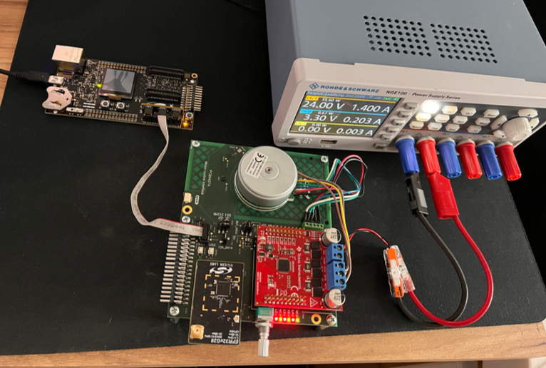

### Assembly
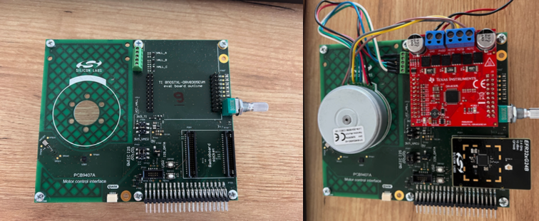

### PCB wiring details
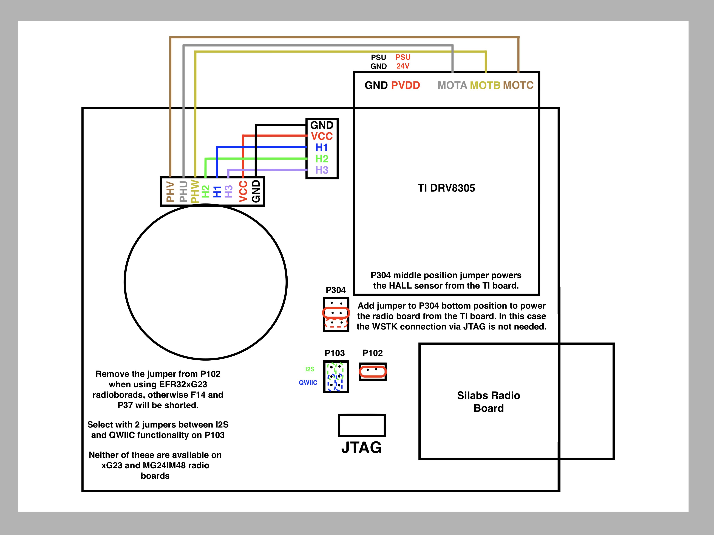

Detailed wiring descriptions for the supported boards are available in the `projects/project_name/readme.md`:

- [Sparkfun Thing Plus Matter](../projects/simplefoc-port-thingplusmatter/readme.md)
- [BRD4186C](../projects/simplefoc-port-brd4186c/readme.md)
- [BRD4401C](../projects/simplefoc-port-brd4401c/readme.md)

### Reset button
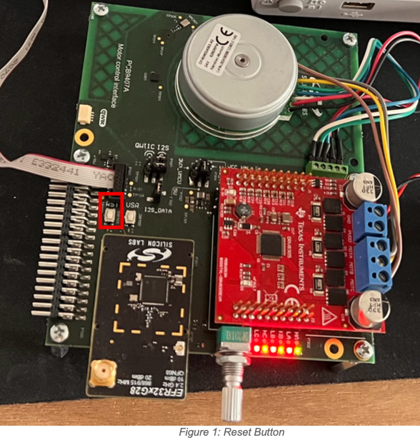

### WSTK switch
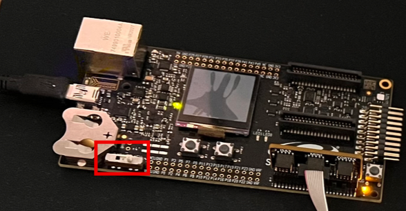

The switch on the WSTK shall be in the **AEM** position.

---

## Software setup

The Simplicity Commander is the recommended tool for programming.

1. Download and install the “Si Connect” application on the phone.
2. Install and launch Simplicity Commander.
3. Connect the WSTK to the PC.
4. **Configuration steps:**
   1. Select the connected Silabs radio board.
   2. Verify the connected device.
   3. Click on the Kit icon.
   4. Select the OUT Debug mode.

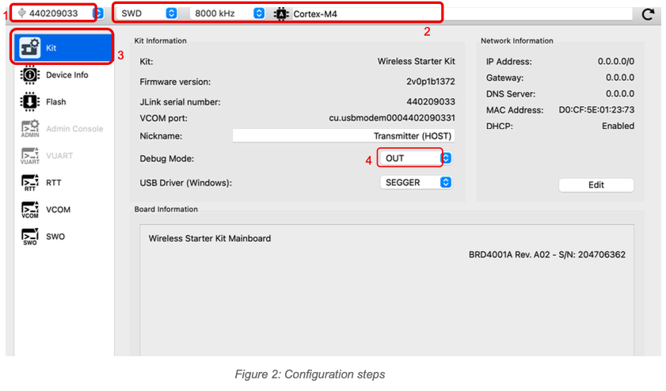

5. **Flashing steps:**
   1. Click the Flash icon.
   2. Erase the chip.
   3. Select the application location (choose the `.s37` file).
   4. Flash the application.

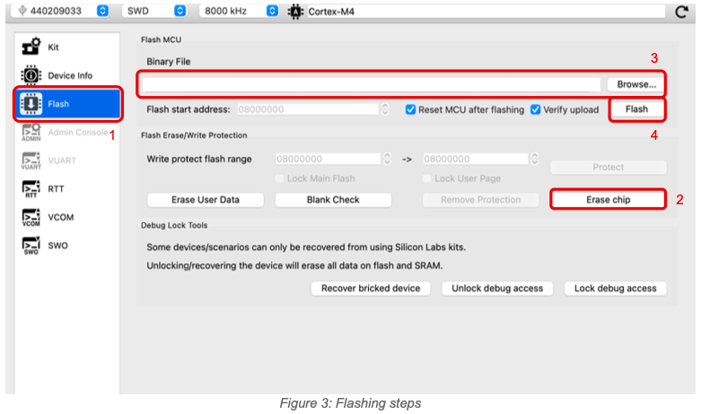

Detailed Simplicity Commander reference guide:  
<https://www.silabs.com/documents/public/user-guides/ug162-simplicity-commander-reference-guide.pdf>

---

## Demo setup

### System configuration

1. Power off all devices (PSU, WSTK).
2. Power on the WSTK and make sure the switch is in the AEM position.
3. Erase the chip.
4. Program the application (`.s37`).
5. Hold the reset button on the interface board.
6. *(while holding the reset button)* Enable the PSU output with 24V and min. 1.4A configuration.
7. Release the reset button. (The application starts and the motor will spin up.)
8. *(Optional) Add a jumper to the bottom slot of the [P304 connector](#pcb-wiring-details) to power the radio board from the PSU (TI board). Then, the WSTK can be disconnected from the board.*

### J-Link RTT Viewer configuration

1. WSTK connection is required for the RTT viewer.
2. Open the J-Link RTT Viewer and connect to the device.
3. You can control the motor from the RTT viewer.
   - **M0** – stop the motor
   - **M50** – rotate the motor at 50 RPM
   - **M-100** – rotate the motor in the opposite direction at 100 RPM.

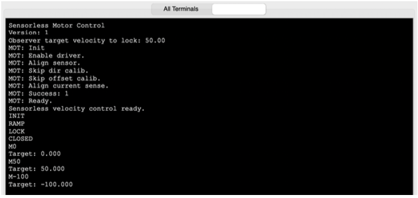

### BLE Connection Setup
Scan for BLE devices using **Si Connect** application. In the list of detected devices, identify the one named in the format motor_xxyyzz, where xxyyzz corresponds to a portion of the device's Bluetooth address. To establish a connection with the device, the user must click the **Connect** button.

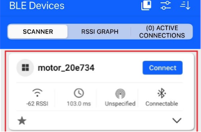

Select service "**4880C12C-FDCB-4077-8920-A450D7F9B907**" and press "**More info**" to see the characteristics. Users may rename the Service and Characteristic fields for easier identification. To begin sending commands, choose the **Write** option. To receive messages from the device, enable the **Notify** option.

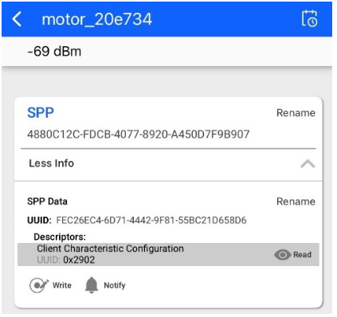

At this point, users can input commands to be transmitted to the device for execution.
*Note: Append the value 0x0A (LF) or 0x0D (CR) at the end of the line to terminate a CLI command.*

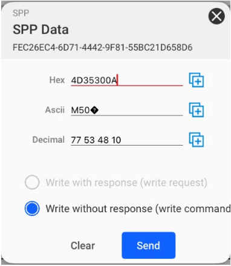

Available commands can be found at <https://docs.simplefoc.com/commander_motor>.

---
