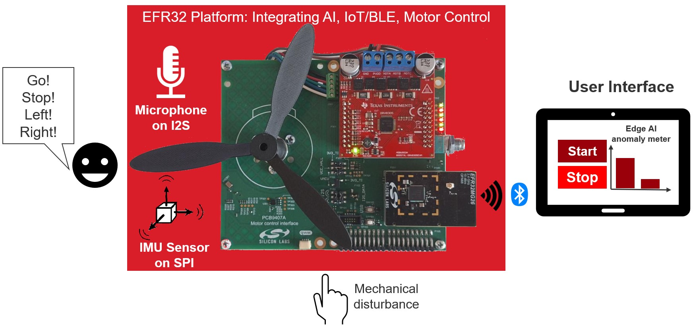
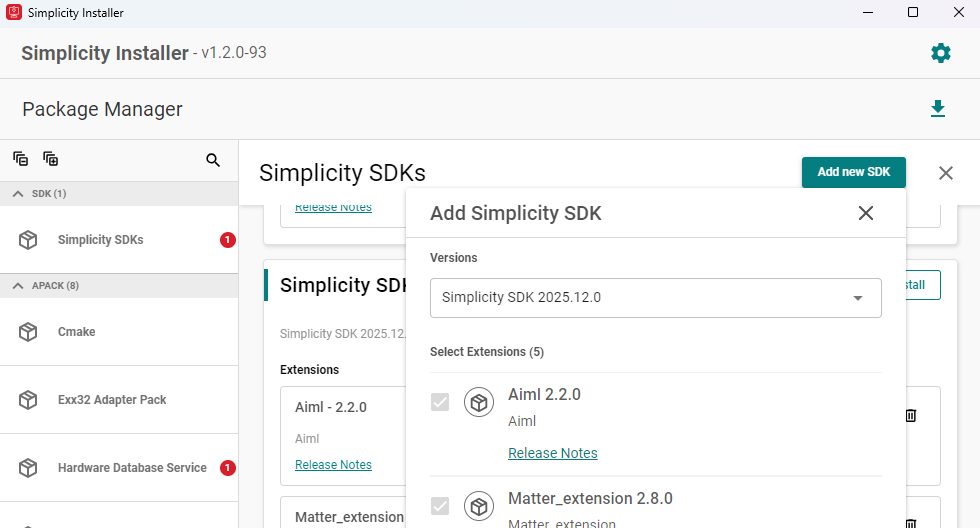

# Motor Control Framework — Anomaly & Voice Example

Runs closed-loop **Hall-sensor velocity control** on a 3-phase BLDC motor and
adds an on-device **AI/ML layer** with two TensorFlow Lite Micro models that can
be switched at runtime:

- **IMU vibration anomaly** — an autoencoder watches accelerometer data from the
  on-board LSM6DSM and produces an *anomaly score*. When the motor is running,
  an abnormal vibration signature raises the score.
- **Audio keyword spotting** — an I2S microphone feeds a spectrogram front-end
  (`ml_audio_feature_generation`) into a small classifier that recognizes the
  spoken keywords `on` / `off`.

Both models share a single TFLite arena (see `ml_common.h`); only one is loaded
at a time. The **user button (BTN0)** toggles between them, and the active model
is reported over BLE/RTT.

A safety feature ties the IMU model back to the motor: with the anomaly
**fail-safe enabled**, an anomaly score above the threshold forces the motor
target to `0` (stop). A short *blanking* window after each setpoint change
suppresses false trips caused by the speed transient itself.



## What it does

- Drives the motor through a 6-PWM gate driver (BOOSTXL-DRV8305) using Hall
  sensors for commutation and closed-loop velocity control.
- Runs the FOC loop at 5 kHz on a dedicated timer ISR; `move()` + command
  handling run in a lower-rate task.
- Loads either the IMU-anomaly or the audio-keyword model (button to switch).
- Streams telemetry over a BLE SPP service and accepts SimpleFOC `Commander`
  commands over both BLE and RTT.

## Hardware

| Item | Notes |
|------|-------|
| Radio board | **BRD4120A** (EFR32MG26) — pin map shipped as a framework overlay |
| Motor driver | TI BOOSTXL-DRV8305 BoosterPack |
| Motor | 3-phase BLDC with Hall sensors (`MOTOR_PP = 8`) |
| Interface board | Connects Motor driver, Radio board and sensors - PVB9407A|
| IMU | On-board ST LSM6DSM (SPI, EUSART `exp` instance, CS = PA6) |
| Microphone | On-board I2S MEMS microphone |
| Power | 24 V supply for the motor stage |

Motor pins, Hall pins, current-sense, SPI and motor parameters live in
`config/motor_control_framework_config.h` (filled from the **brd4120a** overlay
when you create the project for that board). The microphone I2S pins, IMU SPI
(`exp`) pins and button pin are set from the project `.slcp` configuration.

## Getting started

0. Install the Motor Control Framework Extension in Simplicity Studio 6: [README.md](../../../README.md#2-install-the-extension-in-simplicity-studio-6)
1. Install the AIML extension with the Simplicity Installer/Package Manager:
  
2. Create this example in Simplicity Studio and select the **BRD4120A** radio
   board so the pin overlay is applied.
3. Connect the radio board to the DRV8305 BoosterPack and wire the motor + Hall
   sensors.
4. Build, flash, and open an RTT terminal or connect over BLE with web app: https://markwendler.github.io/motor-ble-controller/.
5. On boot the **IMU-anomaly** model is active. Send a velocity target with the
   SimpleFOC `Commander` `M` command, e.g.:

   ```
   M30
   ```

6. Press **BTN0** to switch to the **audio keyword** model; press again to
   switch back to the IMU model.

### SystemView timestamp resolution (optional, higher-resolution traces)

This example ships with **SEGGER SystemView** configured to use the
**sleeptimer** as its timestamp tick base
(`SEGGER_SYSVIEW_TIMESTAMP_SOURCE_SLEEPTIMER`, set in the project `.slcp`). This
compiles **out of the box** — no manual edits required. The only trade-off is
timestamp resolution: SystemView timestamps tick at the sleeptimer frequency
rather than the CPU clock.

If you want **higher-resolution** SystemView logging, switch the timestamp
source to the **DWT cycle counter**, which ticks at `SystemCoreClock`:

1. In Project Configurator (or the project `.slcp` `configuration:` section) set:

   ```
   SEGGER_SYSVIEW_TIMESTAMP_SOURCE = SEGGER_SYSVIEW_TIMESTAMP_SOURCE_DWT
   ```

2. Add a CMSIS device-header include to the generated
   `config/sl_systemview_config.h`, just inside the include guard, so `DWT` is
   declared when `SEGGER_SYSVIEW.c` is compiled:

   ```c
   #ifndef SL_SYSTEMVIEW_CONFIG_H
   #define SL_SYSTEMVIEW_CONFIG_H

   #include "em_device.h"   // <-- add this line (declares DWT->CYCCNT)
   ```

   Without this include the DWT build fails with
   `error: 'DWT' undeclared ... DWT->CYCCNT`.

This second step can't be automated from the `.slcp`: the `segger_systemview`
component declares `sl_systemview_config.h` **without a `file_id`**, so the
project cannot register a `config_file` override for it (a plain `config_file`
entry collides with the component and fails generation with *"file
sl_systemview_config.h is defined for multiple components"*). Hence it's a
one-time manual edit only needed when opting into the DWT source.

## BLE / serial interface

The device advertises an SPP service (`spp_data` characteristic, write +
notify). A telemetry task pushes a status line about twice per second:

```
Motor: Running  Speed: 29.98 Anomaly: 12% mode: imu
```

`Commander` commands accepted over BLE and RTT:

| Command | Meaning |
|---------|---------|
| `M<value>` | Motor command (SimpleFOC), e.g. `M30` sets velocity target [rad/s] |
| `AOFF1` | Enable the anomaly fail-safe (auto-stop on high anomaly) |
| `AOFF0` | Disable the anomaly fail-safe |

When the fail-safe is enabled and the anomaly score exceeds
`FAIL_SAFE_ANOMALY_LEVEL` (default 70 %), the motor target is set to `0`.

## Customization

- **Motor parameters / pins** — `motor_control_framework_config.h`
  (Configuration Wizard): pole pairs, Hall/PWM/current-sense pins, SPI.
- **Anomaly fail-safe** — `FAIL_SAFE_ANOMALY_LEVEL`, blanking window and
  setpoint-step threshold in `motor_control.cpp`.
- **Anomaly model scaling** — sequence length, normalization (mean/std),
  sigmoid threshold/scale in `constants.h`.
- **Keyword detection** — smoothing window, detection threshold, category
  labels in `config/audio_classifier_config.h`.
- **TFLite arena / heap** — `SL_TFLITE_MICRO_ARENA_SIZE`, `SL_HEAP_SIZE` in the
  project `.slcp`.

## Key source files

| File | Role |
|------|------|
| `motor_control.cpp` | Hall FOC, control tasks, anomaly fail-safe + blanking |
| `app.cpp` | Model-switch orchestration, button handler |
| `imu_task.cpp` | LSM6DSM sampling + autoencoder inference → anomaly score |
| `audio_classifier.cc` / `recognize_commands.cc` | Keyword-spotting pipeline |
| `ml_common.h` | Shared single-arena TFLite interpreter manager |
| `telemetry.cpp` | Periodic BLE status stream |
| `ble_handler.cpp` | BLE stack events + SPP data plumbing |
| `imu/` | LSM6DSM driver |
| `tflite/autoencoder_quantized.tflite` | IMU anomaly model (flatbuffer) |
| `model/sl_tflite_micro_model_audio.c` | Audio keyword model (array) |
